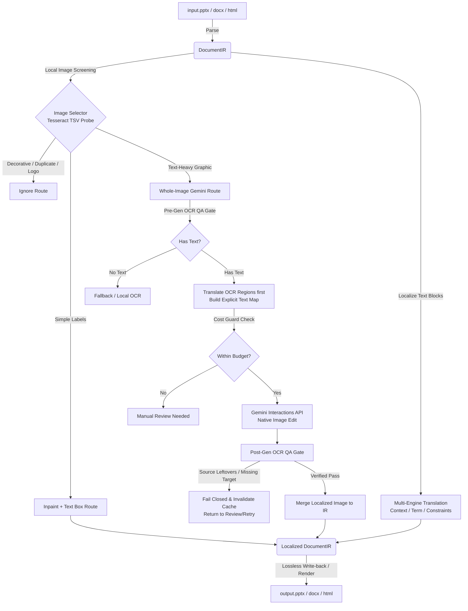

# Translayer (v0.2.1)

English | [简体中文](README.zh-CN.md) | [Deutsch](README.de.md)

[](LICENSE)
[](pyproject.toml)
[](#)
[](#installation)

**Any format in, any language out — layout, typesetting, and in-image text intact.**

Translayer is an AI-native document localization middle layer. Existing translation tools treat document translation as a pure NLP problem, resulting in broken slide layouts, ignored text inside graphics, and formatting collapse. Translayer solves this by parsing documents into a unified intermediate representation (**DocumentIR**), enriching them with layout and OCR metadata, localizing them through human-in-the-loop and VLM-based workflows, and rendering them back losslessly — including redrawing/editing in-image text.

---

## 🤖 AI & Developer Quick Reference (LLM-Ready Context)

This section provides a machine-readable summary of the codebase structure, interfaces, and architecture to help LLMs and AI agents quickly index and modify this repository.

```
.
├── src/translayer/
│   ├── api/                 # Web server (FastAPI, Uvicorn, SQLite/JSON Job storage)
│   ├── engines/             # Pluggable backends
│   │   ├── image/           # Whole-image localization (Gemini, Cost Guard)
│   │   ├── ocr/             # OCR Engines (Tesseract, Paddle OCR, Cloud Vision)
│   │   └── translation/     # Text translators (DeepL, Gemini, mock)
│   ├── enrich/              # Enrichment pipeline (Tesseract screening, image text selection)
│   ├── ir/                  # Intermediate Representation definitions and JSON Schemas
│   ├── localize/            # Quality Gates, explicit text mapping, and pipelines
│   ├── parsers/             # Document parsing (PPTX, DOCX, HTML)
│   ├── renderers/           # Lossless document generation and write-back
│   └── web/                 # HTML5/JS Trilingual single-page App (default: English)
├── tests/                   # Integration and unit tests
├── Dockerfile               # Production environment with LibreOffice, Poppler, Tesseract
└── pyproject.toml           # Project dependencies and entrypoints
```

### Key Data Schemas & Contracts
* **Primary Entrypoints**: `translayer.cli:app` (Typer CLI), `translayer.api.app:app` (FastAPI Server).
* **DocumentIR Specification**: Standardized intermediate schema representing slide elements, layout constraints (EMUs), resources (fonts, images), translatable blocks, and OCR region mapping.
* **Core Pipeline Contract**:
  ```
  [Input Doc] -> Parse() -> DocumentIR -> Enrich() -> Localize() -> Render() -> [Output Doc]
  ```

---

## 🧩 Architectural Architecture & Pipeline



### The Four-Stage Flow
1. **Parse**: Formats are converted into `DocumentIR` by reading shapes, paragraph trees, SmartArt (`ppt/diagrams/dataN.xml`), text runs, and image assets.
2. **Enrich**: Enhances the document model with semantic roles, extracts terms, and runs **Local Image Screening** to filter decorative elements, icons, logos, and exact duplicates.
3. **Localize**: Translates text blocks with context constraints, while routing qualified images to the specialized **Gemini native image editing sub-pipeline**.
4. **Render**: Swaps in localized images and writes back translated texts using precise coordinate and font constraints, guaranteeing byte-for-byte preservation of unmodeled elements.

---

## ✨ Key Features (v0.2.1)

* **🌐 Multilingual & Font-Aware OCR**: Full support for English, Chinese, and German as source/target languages. Automatically provisions language-specific OCR engines (e.g. Tesseract langpacks) and selects proper rendering fonts.
* **⚡ Human-in-the-Loop Image Screening**: Uses local, zero-API Tesseract TSV probes (`--psm 11`) to analyze images for text density, line count, and OCR confidence. Separates text-heavy graphics from simple labels, lets users manually select images for AI translation in the review UI, and filters out system icons.
* **🛡️ Pre- & Post-Generation OCR Quality Gates**:
  - **Pre-Gen**: Runs text translation first to create an explicit `source -> target` mapping list. If OCR detects no text or mapping fails, the engine fails closed to prevent API waste.
  - **Post-Gen**: Re-OCRs the Gemini-generated image. If it detects un-erased source text (residual leftovers) or missing target translations, it invalidates the cache and returns the job to manual review.
* **💰 Cost Guard System**: Configurable per-job cost limits, estimated provider costs, and a budget gate to prevent runaway API fees.
* **🖥️ Trilingual Web Interface**: Single-page, modern layout (defaults to English, supports Chinese and German) featuring document upload, advanced settings, cost estimation, image review panels, live progress monitoring, and output download.
* **🔑 Task-scoped Provider Credentials**: Users can configure any OpenAI-compatible translation endpoint, DeepL, and optional Gemini image editing directly in the web UI. Secrets stay in the in-memory job and are never returned by public job APIs.
* **💵 Visible Image Cost Forecasts**: The UI shows the configured per-image planning rate, projected paid calls, estimated total, and a hard approval budget before Gemini image editing starts.
* **🐳 Production Docker Container**: Fully-packaged image featuring LibreOffice, Poppler, Tesseract (with eng, chi_sim, deu packs), Python 3.11, and multilingual fonts.

---

## 📐 DocumentIR Data Contract (v0.1.0 Specs)

Every document is represented by a standardized JSON object. Below is a simplified schema block for AI integration reference:

```jsonc
{
  "schema_version": "0.1.0",
  "meta": {
    "source_lang": "en",
    "target_lang": "zh",
    "doc_type": "pptx",
    "title": "Strategy Deck"
  },
  "resources": {
    "images": [
      {
        "id": "img-slide3-0",
        "media_type": "image/png",
        "data_ref": "assets/img-slide3-0.png",
        "width": 1280,
        "height": 720,
        "text_regions": [
          {
            "id": "reg-0",
            "bbox": [100, 200, 300, 250],
            "source_text": "Executive Summary",
            "target_text": "执行摘要",
            "translatable": true,
            "background_kind": "solid"
          }
        ],
        "localization_validation": {
          "status": "passed", // "passed", "failed", "not_run"
          "reason": null,     // "residual_source_text", "missing_target_text", etc.
          "expected_texts": ["Executive Summary"],
          "expected_translations": ["执行摘要"]
        }
      }
    ]
  },
  "blocks": [
    {
      "id": "s3-sh5-p1",
      "type": "shape_text",
      "source_text": "Core Metrics and Goals",
      "target_text": "核心指标与目标",
      "translatable": true,
      "constraints": {
        "max_chars": 50,
        "can_shrink_font": true,
        "min_font_size": 9
      },
      "source_ref": {
        "kind": "shape_text",
        "slide_index": 3,
        "shape_id": 5,
        "paragraph_index": 1
      }
    }
  ]
}
```

---

## 📥 Installation

### Prerequisites
Translayer requires a few system packages for document and image processing:
- **LibreOffice**: For document format conversions (PDF/PPTX).
- **Poppler-utils**: For `pdftoppm` rasterization checks.
- **Tesseract OCR**: For local screening and verification.

On macOS:
```bash
brew install libreoffice poppler tesseract tesseract-lang
```

On Ubuntu/Debian:
```bash
sudo apt-get update && sudo apt-get install -y \
    libreoffice \
    poppler-utils \
    tesseract-ocr \
    tesseract-ocr-eng \
    tesseract-ocr-chi-sim \
    tesseract-ocr-deu
```

### Python Package Installation
We recommend using [uv](https://github.com/astral-sh/uv) for fast, robust virtual environment and dependency management:

```bash
# Create and activate environment
uv venv --python 3.11
source .venv/bin/activate

# Install package in editable development mode
uv pip install -e ".[dev]"
```

### Docker Deployment
The quickest way to run a production-ready server without installing system dependencies is via Docker:

```bash
# Build the production image
docker build -t translayer:latest .

# Run the trilingual API & Web Server
docker run -d \
  -p 8000:8000 \
  -e GEMINI_API_KEY="your_api_key_here" \
  --name translayer-server \
  translayer:latest
```

---

## ⚙️ Command-Line Interface (CLI) Reference

Translayer is built around a comprehensive CLI suite powered by `typer`.

### 1. Translate a Document End-to-End
Translate any `.pptx`, `.docx`, or `.html` document.
```bash
translayer translate input.pptx -o output.pptx \
  --from en \
  --to zh \
  --engine openai \
  --api-url http://llm.internal:8000/v1 \
  --api-key optional-local-key \
  --model my-local-model \
  --ocr-engine tesseract \
  --glossary my_terms.csv
```
*Options:*
* `--engine openai`: Use any OpenAI-compatible Chat Completions API. Set
  `--api-url`, `--model`, and, when the server requires authentication, `--api-key`.
* `--engine deepl --api-key ...`: Use DeepL API Free or Pro; the endpoint is selected
  automatically from the key. `--api-url` can override the DeepL base URL.
* `--no-images`: Skip in-image text translation entirely.
* `--no-image-screening`: Force API translation for all images without screening (not recommended, increases cost).

### 2. Standalone In-Image Design-Aware Translation
Directly translate text inside a single raster image while preserving its visual design and background using Gemini's native image-editing engine, protected by dual OCR gates.
```bash
translayer translate-image input.png -o output_localized.png \
  --from en \
  --to de \
  --allow-paid-api \
  --max-cost-usd 0.10
```

### 3. Generate a Local Routing and Cost Plan
Inspect a document locally, evaluate images, estimate costs, and check against a budget *without making any paid API calls*:
```bash
translayer plan-images input.pptx -o cost_plan.json \
  --from en \
  --targets zh,de \
  --budget-usd 1.50
```

### 4. Start the Web UI & FastAPI Server
```bash
translayer serve --host 127.0.0.1 --port 8000
```

The job form accepts task-scoped credentials for OpenAI-compatible translation,
DeepL, and optional Gemini image-text localization. A Gemini API key is needed only
when the approved image plan contains paid whole-image edits. The UI shows the
configured per-image planning estimate and the projected total before approval;
actual provider billing may differ from this safety estimate.

---

## 🔌 Extensibility & Plugin Registry

Translayer uses a strict, type-hinted registry model. You can extend any stage by registering custom adapters.

```python
from translayer.plugins import registry

# Register a custom Translation Engine
@registry.register("translation", "my_custom_translator")
class CustomTranslationEngine:
    name = "my_custom_translator"
    
    def translate(self, texts: list[str], src: str, tgt: str, context: str | None = None) -> list[str]:
        # Implement your custom LLM/translation logic here
        return [f"[Custom Target] {t}" for t in texts]

# Register a custom Inpaint/Image Eraser
@registry.register("inpaint", "my_custom_inpaint")
class CustomInpaintEngine:
    name = "my_custom_inpaint"
    
    def inpaint(self, image_path: str, mask_path: str, out_path: str) -> None:
        # Implement custom canvas replacement/erasing
        pass
```

List all loaded and available plugins via the CLI:
```bash
translayer plugins
```

---

## 📈 Roadmap & Core Focus

* **Format Interoperability**:
  - [x] Lossless PPTX Parser/Renderer with full SmartArt namespace preservation.
  - [x] Modular HTML/DOCX Parsers.
  - [ ] Support for native XLIFF imports and exports.
* **Image Localization Engine**:
  - [x] Zero-API screening & routing.
  - [x] Dual-Gate OCR Pre/Post QA validation.
  - [x] Gemini interactions API integration for design-aware in-painting.
  - [ ] Fine-tuned local SDXL/Inpaint models to operate entirely offline.
* **Human-in-the-Loop UX**:
  - [x] Interactive web interface with visual side-by-side comparison.
  - [x] Inline manual override for translations and image selections.

---

## 📄 License

Translayer is open-source software licensed under the [Apache License 2.0](LICENSE).
