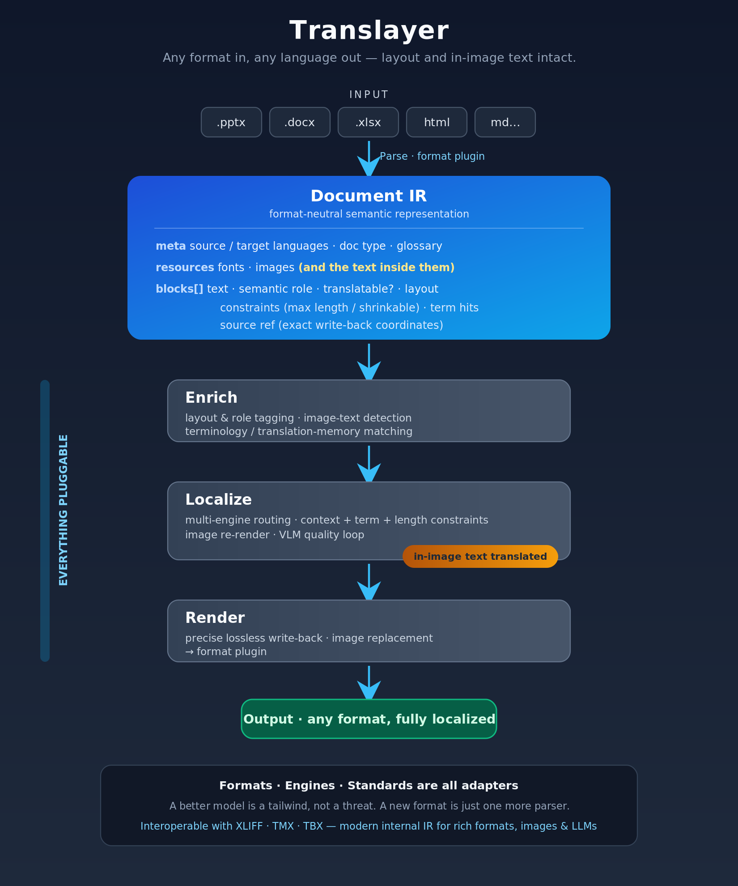

# Translayer

### Any format in, any language out — layout and in-image text intact.

**Translate documents into any language without breaking layout — even the text inside images.**

---

## Why Translayer

Translating a real-world document — a deck, a report, a brochure — is not a text problem. It's a **document-engineering problem**.

Today's tools fail in three predictable ways:

- **Layout breaks.** Upload a `.pptx` and it errors out, or gets flattened to PDF and the structure shatters. Translated text overflows its boxes.
- **Quality collapses across language families.** One engine for every language pair. Great English→German, poor English→Chinese.
- **Text inside images is ignored.** Charts, diagrams, AI-generated graphics — every translator leaves the words baked into images untouched.

Translayer is built to solve all three at once.

## What it does

Translayer is an **AI-native document localization layer**: a format-neutral middle layer that parses any document into a unified semantic representation, localizes it with the right engine for each language and content type, and renders it back into the original format — losslessly.

- 🖼 **Translates text inside images** — detect, translate, erase, and re-render with real fonts. The thing every other tool skips.
- 📐 **Layout-faithful** — semantic layout modeling with length/size constraints, so titles, text boxes, and tables don't break or overflow.
- 🧠 **AI-native pipeline** — whole-document context, per-language-pair engine routing, terminology injection, and a VLM self-check quality loop.
- 🔌 **Pluggable everything** — formats, translation engines, and standards are all adapters. New model? New format? Drop in a plugin.
- 🔓 **Open & self-hostable** — Apache-2.0, private-deployment friendly, auditable. Your confidential documents never have to leave your network.

## How it works

  

**One principle: everything is pluggable.** Formats (Parse/Render), engines (Localize), and intelligence (Enrich) are fully decoupled — so a better model is a tailwind, not a threat, and a new format is just one more parser.

Translayer speaks the localization industry's language too: import/export **XLIFF**, with **TMX/TBX** for translation memory and terminology — interoperable with existing tooling, while the internal IR stays modern enough for rich formats, images, and LLMs.

## Status

🚧 **Early development.** First milestone: English→Chinese PowerPoint with in-image text translation and faithful layout — the wedge no existing tool handles well.

See [the roadmap](#roadmap) for what's next. Stars, ideas, and early contributors are very welcome.

## Roadmap

- [ ] **MVP** — `.pptx`, English→Chinese, in-image text, lossless layout, side-by-side review
- [ ] More formats — `.docx`, `.xlsx`, HTML, Markdown (via format plugins)
- [ ] More language pairs & engine routing
- [ ] Translation memory & glossary (XLIFF / TMX / TBX)
- [ ] Private / self-hosted deployment
- [ ] Collaborative review & version management

## Contributing

Translayer aims to become an **open standard** for document localization, and the architecture is built for contribution: adding a format or an engine should mean writing one focused plugin. Contribution guides are coming as the core stabilizes — until then, open an issue to share ideas, use cases, or the documents that break everything else.

## License

[Apache License 2.0](LICENSE).
